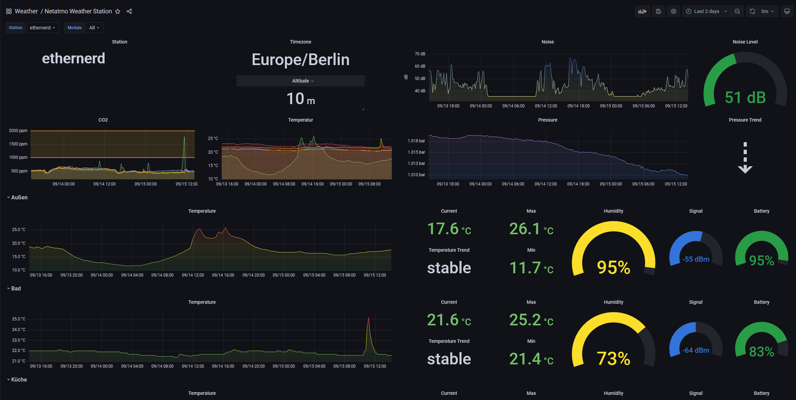

# grafana-netatmo


Netatmo Weather Station dashboard for Grafana

[https://grafana.com/grafana/dashboards/12378](https://grafana.com/grafana/dashboards/12378)



## InfluxDB 2.0
This new Version is for InfluxDB 2.0 only. If you want to use an older Influx Version, don't use this.

If you want to upgrade your Docker InfluxDB to 2.0, there is a guide available [here](https://docs.influxdata.com/influxdb/v2.0/upgrade/v1-to-v2/docker/).

I also upgraded the Dashboard to FluxQL. If you want to use it, just import ``dashboard_influx2.json`` instead.

Influx 2.0 also uses tokens instead of password authentication. 

## Installation

* Create a [Netatmo developer account](https://dev.netatmo.com/apidocumentation), create file called "config" or use Environment Variables and fill in your CLIENT_ID, CLIENT_SECRET, USERNAME and PASSWORD.
* Environment Variables take precedence over everything else and will overwrite your config vars.
* The default is to search for a config file right next to the script, but you can point to any config file with the "-f" switch.

```ini
[global]
interval = 300
loglevel = INFO

[netatmo]
client_id =
client_secret =
netatmo_username =
netatmo_password =

[influx]
influx_host =
influx_port =
influx_bucket =
influx_protocol =
influx_token =
influx_org =
```

* Create a cron job to run the script periodically e.g.

```bash
# cat /etc/cron.d/netatmo
*/5 * * * * root  /usr/local/bin/netatmo_influx.py > /dev/null 2>&1
```

You can also use docker to run the script. Either build it yourself or use my prebuild containers at [Docker Hub](https://hub.docker.com/r/karaktaka/grafana-netatmo).
